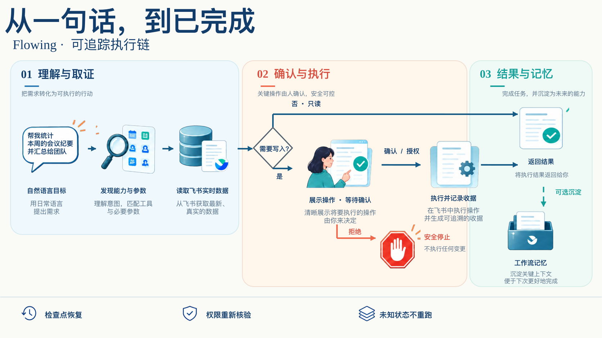

<div align="center">


# 飞序 Flowing

### 一句话，流向已完成。

面向飞书的 AI 工作台：理解目标，读取真实数据，确认关键写入，留下可追溯结果。

[](LICENSE)
[](frontend/package.json)
[](backend/pyproject.toml)
[](backend/app/skills/lark_cli/agent_graph.py)

[快速启动](#快速启动) · [三种入口](#三种入口) · [部署指南](docs/DEPLOYMENT.md) · [微信与 Telegram](docs/PRIVATE-BOT-CHANNELS.md)


</div>

## 先说清楚它能做什么

你只需要描述想要的结果，飞序会把目标拆成可执行步骤：先发现当前账号可用的飞书能力，再读取并核验实时信息；涉及创建、修改、发送等写操作时，先展示具体操作，等你确认后继续。授权中断可以恢复，执行结果会回到同一个会话。

例如：

> 找出我和小王明天共同空闲的一小时，创建项目复盘会议，再把会议信息发给他。

这条请求可能依次使用联系人、日历忙闲、日程创建和消息发送能力。缺少参数、权限不足或结果不确定时，系统会停下来说明情况，不会猜测重放。

## 三种入口

同一个账号可以从网站、个人微信或个人 Telegram 发起任务。入口共享本人的飞书授权、工作流记忆和执行器；会话与绑定身份彼此隔离。

| 入口 | 连接方式 | 适合什么 | 当前边界 |
| --- | --- | --- | --- |
| **Web 工作台** | 浏览器登录 | 查看完整计划、确认卡片、执行详情、PPT 预览 | 推荐用于首次授权和长内容 |
| **微信机器人 / ClawBot** | 网站生成二维码 → 手机扫码/验证码 → 本人确认 | 随手发送文字任务 | 个人私聊、纯文本；不读取其他微信聊天 |
| **Telegram 机器人 / Bot** | 服务端配置 BotFather Token → 扫码打开 → 点击 Start | 跨设备发送文字任务 | 个人私聊；官方 `getUpdates` 长轮询，不使用 webhook |

两条机器人渠道都需要绑定到网站账号。机器人发起的写操作仍会返回一次性确认码（10 分钟有效），只能在原绑定私聊中确认；过长内容和飞书授权请回到网站处理。完整绑定、隔离和单主机部署说明见[微信与 Telegram 私人助手](docs/PRIVATE-BOT-CHANNELS.md)。

## 一条可追踪的执行链



[查看高清图](docs/assets/execution-chain-ai.png)

默认执行器是 LangGraph，使用 SQLite 检查点保存中断状态；旧 `legacy` 执行器仍保留为兼容路径。每次工具调用都会重新检查账号、权限和渠道绑定。执行未知或消息送达未知时会标记状态并等待人工判断，不自动重跑。

## 能力地图

### 飞书协作

- **消息与组织**：私聊、群聊、群成员、联系人和组织信息。
- **日历与会议**：日程、参会人、会议室、忙闲、报名与 VC 相关信息。
- **内容与知识**：飞书文档、Wiki、云空间、评论、导入导出和白板。
- **数据与流程**：Sheets、Base/多维表格、字段映射、审批、考勤、事件和任务。
- **会议产物**：会议纪要、录音/笔记检索，以及把结果继续写回飞书。

能力目录会随运行时工具和当前授权动态变化；项目列出的覆盖范围不等于每个账号都拥有全部权限。

### AI PPT

从对话生成或修改 PPTX，支持内置模板和自定义模板、版本记录、逐页预览、下载，以及通过明确按钮上传飞书云文档或发送给群聊/联系人。分发动作不会因为生成完成而自动发生。

### 记忆、定时与团队协作

| 模块 | 行为 |
| --- | --- |
| **工作流记忆** | 保存候选经验与已记住流程，可查看来源、步骤、成功次数并停用；实时资源、权限和确认永远重新核验。 |
| **定时任务** | 一次、每天、工作日；创建前确认，可暂停、恢复、删除；任务与检查点持久化在 SQLite。 |
| **团队模板** | 场景模板、AI 生成草稿、版本、发布、回滚；支持账号专属的多维表格别名和字段映射。 |
| **账号与权限** | 密码登录或企业 OAuth/PKCE；employee、lead、admin 角色；会话、授权、PPT 和记忆按账号隔离。 |

## 安全边界

- 新空库首次登录只能使用部署者自行设置的初始化管理员密码（至少 12 位）；项目没有通用默认账号或密码。
- 写操作必须经过权限检查和明确确认；机器人确认码一次性、限时且绑定到原私聊身份。
- 微信只接收已绑定 `ilink_user_id` 的最终私聊文本；Telegram 同时校验 private chat 和发送者 ID。
- 入站消息先写入 SQLite，通过绑定 ID + 平台事件 ID 去重；每个绑定最多排队 20 条，最多同时执行 4 个机器人任务。
- 当前模型是单主机 SQLite + 本地锁/轮询设计；不支持多主机或 NFS 共享数据目录。生产环境请使用 HTTPS，并妥善保存数据库、加密密钥、模型密钥和机器人 Token。

## 快速启动

需要 Python 3.12、Node.js 20，以及能访问模型服务和飞书接口的网络环境。

### Docker Compose（推荐）

```sh
cp .env.example .env
# 编辑 .env：填写模型配置、OPENAI_API_KEY，以及自定义的至少 12 位 AUTH_BOOTSTRAP_PASSWORD
docker compose up -d --build
docker compose logs -f flowing
```

打开 <http://localhost:8000>，使用你设置的账号登录，再在「账号与权限」中完成飞书 CLI 初始化和个人授权。

### 本地运行

```sh
cp .env.example .env
python3.12 -m venv backend/.venv
backend/.venv/bin/python -m pip install -r backend/requirements.txt
npm --prefix frontend ci
npm --prefix frontend run build
npm install -g @larksuite/cli
npx skills add larksuite/cli -y -g
cd backend
.venv/bin/python -m uvicorn app.main:app --host 127.0.0.1 --port 8000
```

打开 <http://127.0.0.1:8000>。企业 OAuth、反向代理、数据备份和环境变量详见[部署指南](docs/DEPLOYMENT.md)；开发、测试和接口入口详见[开发指南](docs/DEVELOPMENT.md)。

### 可选：启用私人机器人

```dotenv
BOT_CHANNELS_ENABLED=true
FEISHU_TOKEN_ENCRYPTION_KEY=你的32字节Base64密钥
TELEGRAM_BOT_TOKEN=BotFather生成的Token
```

微信不需要手填 Token，绑定时由扫码流程获取并由服务端加密保存。Telegram 留空时入口会显示“未配置”，不会影响网站和微信。配置完成后重启后端，在「账号与权限 → 我的微信 / Telegram 助手」绑定。

## 项目结构

```text
flowing/
├── frontend/                  # Vue 3 + TypeScript + Vite 工作台
├── backend/app/api/routes/    # 聊天、认证、记忆、任务、PPT、机器人接口
├── backend/app/core/          # SQLite、权限、调度、记忆、私人渠道运行器
├── backend/app/skills/        # LangGraph 执行器、飞书工具目录、AI PPT
├── docs/                      # 部署、开发、渠道和品牌说明
└── docker-compose.yml         # 单容器部署入口
```

## 验证与文档

```sh
cd backend
.venv/bin/python -m pytest -q
cd ..
npm --prefix frontend run build
```

当前回归套件覆盖账号隔离、权限、确认/恢复、定时任务、工作流记忆、PPT 资源和私人渠道状态机。更多入口：

[部署与账号管理](docs/DEPLOYMENT.md) · [开发与接口](docs/DEVELOPMENT.md) · [微信 / Telegram](docs/PRIVATE-BOT-CHANNELS.md) · [品牌素材](docs/BRAND.md)

## License

[MIT](LICENSE)。飞序是基于飞书 / Lark 能力构建的独立工作台。
