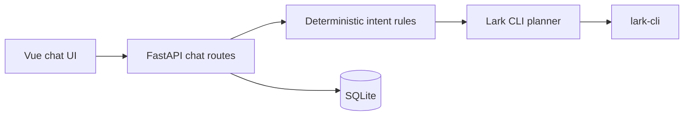

# Project Overview

## Preliminary Direction

Upgrade the Feishu agent from phrase-driven routing to a safe hybrid planner that tolerates natural phrasing, asks about genuine ambiguity, and learns reusable workflows per website account after verified success.

## Current Architecture

The repository is a single FastAPI/Vue application. SQLite owns accounts, sessions, OAuth grants, schedules, and execution records. `LarkCLISkill` selects local skill documentation, builds plans, and executes one CLI step at a time.

## Technology Stack

| Layer | Current | Target |
|:--|:--|:--|
| Backend | Python 3.10+, FastAPI, Pydantic | Same, with typed intent/memory boundaries |
| Frontend | Vue 3, TypeScript, Vite | Same, with memory provenance and controls |
| Database | SQLite | Same, with account-scoped workflow memory |
| Agent | Deterministic rules plus OpenAI/Anthropic-compatible planner | Confidence-aware hybrid planning plus verified experience retrieval |

## Entry Points

- `POST /api/v1/chat/plan` previews a plan without executing it.
- `POST /api/v1/chat` executes after the existing confirmation boundary.
- `backend/app/core/scheduled_tasks.py` detects and runs scheduled requests.
- `backend/app/skills/lark_cli/skill_runtime.py` plans and executes Lark CLI workflows.

## Build & Run

- Backend: `PYTHONPATH=backend pytest -q backend/tests`
- Frontend: `npm run build --prefix frontend`
- Browser regression: `node frontend/tests/workflow-browser.mjs <CDP websocket>`

## Testing Baseline

Pytest covers account isolation, authorization, permissions, schedule lifecycle, and plan execution. A browser script covers the chat confirmation flow. The reported typo/time ambiguity was reproduced against the running service before implementation.

## Project Governance Baseline

No repository `AGENTS.md`, `CLAUDE.md`, native project memory surface, or existing `docs/progress/MASTER.md` was found. This run therefore records progress locally without creating a competing repository memory file.

## External Integrations

Feishu OAuth and APIs are accessed through the installed account-bound `lark-cli` profile. Model planning uses the configured OpenAI- or Anthropic-compatible endpoint. Both are treated as fallible external boundaries.
