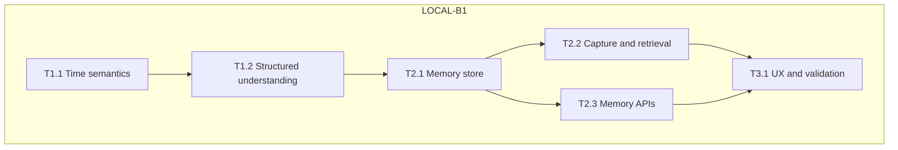

# Task Dependency Graph

```mermaid
graph TD
  subgraph B1[LOCAL-B1]
    T11[T1.1 Time semantics] --> T12[T1.2 Structured understanding]
    T12 --> T21[T2.1 Memory store]
    T21 --> T22[T2.2 Capture and retrieval]
    T21 --> T23[T2.3 Memory APIs]
    T22 --> T31[T3.1 UX and validation]
    T23 --> T31
  end
```
